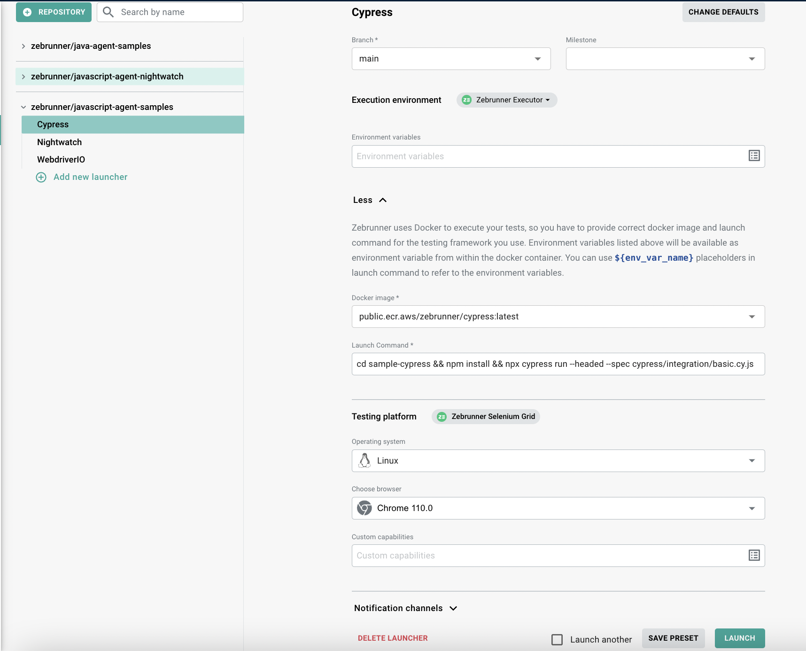

# Zebrunner Cypress agent

The official Zebrunner Cypress reporting agent. 
The Agent works with Cypress v9 and does not support newer versions for now.

## Inclusion into your project

### Adding dependency

First, you need to add the Zebrunner Agent into your `package.json`.

```shell
npm install @zebrunner/javascript-agent-cypress
```
### Reporter setup

The agent does not work automatically after adding it into the project, it requires extra configuration. For this, you need to perform the following 3 steps:

1. Enable reporting plugin in your [Plugins file](https://docs.cypress.io/guides/core-concepts/writing-and-organizing-tests#Plugins-file) (e.g. `cypress/plugins/index.js`):

```javascript
const zbrPlugin = require('@zebrunner/javascript-agent-cypress/lib/plugin');

module.exports = (on, config) => { zbrPlugin(on, config); }
```

2. Add reporting commands by including the following in your [Custom commands file](https://docs.cypress.io/api/cypress-api/custom-commands) (e.g. `cypress/support/commands.js`):

```javascript
require('@zebrunner/javascript-agent-cypress/lib/commands/commands');
```

3. In order to enable browser registration in Zebrunner, include the following code in your [Support file](https://docs.cypress.io/guides/core-concepts/writing-and-organizing-tests#Support-file) (e.g. `cypress/support/index.js`) file where `cy.registerBrowser` is a custom command provided by Zebrunner:

```javascript
import './commands';

before(() => {
  cy.registerBrowser(Cypress.browser);
});
```

## Reporter configuration

Once the agent package is included and enabled in your test project, the valid configuration must be provided.

It is currently possible to provide the configuration via:

1. Environment variables 
2. `cypress.json` config file

The configuration lookup will be performed in the order listed above.
It is also possible to override configuration parameters by passing them through a configuration provider with higher precedence.

### via environment variables

The following configuration parameters are recognized by the agent:

| Parameter                       | Description                                                                                                                                                                  |
| ------------------------------- | ---------------------------------------------------------------------------------------------------------------------------------------------------------------------------- |
| `REPORTING_SERVER_HOSTNAME`     | Mandatory if reporting is enabled. It is Zebrunner server hostname. It can be obtained in Zebrunner on the 'Account & profile' page under the 'Service URL' section          |
| `REPORTING_SERVER_ACCESS_TOKEN` | Mandatory if reporting is enabled. Access token must be used to perform API calls. It can be obtained in Zebrunner on the 'Account & profile' page under the 'API Access' tab |
| `REPORTING_PROJECT_KEY`         | Optional value. It is the project that the test run belongs to. The default value is `DEF`. You can manage projects in Zebrunner in the appropriate section                  |
| `REPORTING_RUN_DISPLAY_NAME`    | Optional value. It is the display name of the test run. The default value is the name of first executed test file name |
| `REPORTING_RUN_BUILD`           | Optional value. It is the build number that is associated with the test run. It can depict either the test build number or the application build number                      |
| `REPORTING_RUN_ENVIRONMENT`     | Optional value. It is the environment where the tests will run  |
| `REPORTING_SLACK_CHANNELS`           | Optional value. Predefined list of Slack channels for results notifications |
| `REPORTING_EMAIL_RECIPIENTS`           | Optional value. Predefined list of recipients for Email notifications |

### via Cypress config

In order to configure agent via Cypress config (`cypress.json` by default), reporter configuration needs to be provided.

Please see reporter configuration snippet below:

```json
{
  "reporter": "@zebrunner/javascript-agent-cypress",
  "reporterOptions": {
      "reportingServerHostname": "<YOUR_ZEBRUNNER_SERVER_URL>",
      "reportingServerAccessToken": "<YOUR_ZEBRUNNER_ACCESS_TOKEN>",
      "reportingProjectKey": "DEF",
      "reportingRunEnvironment": "STAGE",
      "reportingRunBuild": "1.0-alpha",
      "reportingRunDisplayName": "My regression suite",
      "reportingRunLocale": "en_US",
      "reportingSlackChannels": "dev",
      "reportingEmailRecipients": "manager@mycompany.com"
  }
}
```

The following configuration parameters are recognized by the agent:

| Parameter                    | Description                                                                                                                                                                  |
| ---------------------------- | ---------------------------------------------------------------------------------------------------------------------------------------------------------------------------- |
| `reportingServerHostname`    | Mandatory if reporting is enabled. It is Zebrunner server hostname. It can be obtained in Zebrunner on the 'Account & profile' page under the 'Service URL' section          |
| `reportingServerAccessToken` | Mandatory if reporting is enabled. Access token must be used to perform API calls. It can be obtained in Zebrunner on the 'Account & profile' page under the 'API Access' tab |
| `reportingProjectKey`        | Optional value. It is the project that the test run belongs to. The default value is `DEF`. You can manage projects in Zebrunner in the appropriate section                  |
| `reportingRunDisplayName`    | Optional value. It is the display name of the test run. The default value is the name of first executed test file name                                                                                 |
| `reportingRunBuild`          | Optional value. It is the build number that is associated with the test run. It can depict either the test build number or the application build number                      |
| `reportingRunEnvironment`    | Optional value. It is the environment where the tests will run |
| `reportingRunLocale`         | Optional value. Locale, that will be displayed for the run in Zebrunner if specified |
| `reportingSlackChannels`         | Optional value. Comma separated list of slack channels for notifications.|
| `reportingEmailRecipients`         | Optional value. Comma separated list of recipients for email notifications.|

## Launcher configuration

Zebrunner Launcher provides a great way to execute tests without having to worry about the runtime environment.

> To learn more about the Zebrunner Launcher and all it's capabilities, refer to the [Zebrunner Launcher](https://zebrunner.com/documentation/guide/launchers/) documentation page.

The Cypress Agent is fully integrated with the Zebrunner Launcher and requires even less configuration when used with it. The Zebrunner Launcher automatically provides `REPORTING_ENABLED`, `REPORTING_PROJECT_KEY`, `REPORTING_SERVER_HOSTNAME`, `REPORTING_SERVER_ACCESS_TOKEN` and some other environment variables, so there is no need to explicitly specify them or the corresponding `cypress.json` file properties.

If you have included the Zebrunner Agent into your project and pushed the changes to a Git repository, you can easily run your tests using Zebrunner Launcher. For this, you need to navigate to Zebrunner Launcher and add the Git repository (if you have not already). Next, add a new Launcher for the Git repo.

Configuration of the Launcher for Cypress tests is pretty straightforward:

1. Add a meaningful name for the Launcher.
2. Select a Git branch to launch tests from.
3. Make sure the **Zebrunner Executor** is selected as the Execution Environment.
4. Select `public.ecr.aws/zebrunner/cypress:latest` docker image in the dropdown.
5. Enter the launch command. Since each launch with Zebrunner Launcher starts from scratch, you need to install project dependencies as part of the launch command.
   An example of the launch command is `npm install && npx cypress run --headed`.
> Note: it is recommended to put explicitly `--headed` argument to display the browser (instead of running headlessly) for capturing videos.
6. If necessary, add environment variables that will be passed to the tests at runtime.
7. Select a configured Testing Platform (e.g. Zebrunner Selenium Grid) along with operating system and/or desired browser.
8. If the launcher is configured, hit the **Add** button at the bottom of the page.



Now you can launch the tests using Zebrunner CyServer. To do this, click the **Launch** button which is located under the configuration of the selected launcher.

If something went wrong while running the tests, you can examine the logs captured from the docker container. If the launch is stuck in "In Progress" status and there is no link to the logs file, you need to manually abort the launch in the 3-dot menu.

## Parallelized runs

When results are getting tracked in Zebrunner all of them are coming into single test run instance. Such approach is followed for parallel tests execution as well.
To set up proper tracking of parallel runs with Zebrunner you need to specify CI run id parameter. See configuration section to figure out how to make this using `reportingCiRunId` cypress property or `REPORTING_CI_RUN_ID` environment variable.
CI run id must be unique value across Zebrunner project. So simple CI build number will not work as it might intercept with runs on another pipelines within same Jenkins instance.
For example to generate new value inside of Jenkins pipeline you could you construction like this:
`REPORTING_CI_RUN_ID = UUID.randomUUID().toString()`.

> Note: Solution has been tested with Cypress dashboard parallelization approach.

## Tracking test maintainer

You may want to add transparency to the process of automation maintenance by having an engineer responsible for evolution of specific tests or test classes.
Zebrunner comes with a concept of a maintainer - a person that can be assigned to maintain tests.

`owner` attribute should be set in your test implementation. Here is an example:
```javascript
describe('some spec', () => {
  it('test name', {'owner': '<username>'}, () => {...})
})
```

The maintainer username should be a valid Zebrunner username, otherwise it will be set to `anonymous`.

## Collecting additional artifacts

By default agent pushes to Zebrunner server screenshot for every test failure.
Also agent automatically sends video of entire spec execution to Zebrunner for every failed test.
You may find them attached in the appropriate test results page.

## Syncing test executions with external TCM systems

Zebrunner provides an ability to upload test results to external test case management systems (TCMs) on test run finish. For some TCMs it is possible to upload results in real-time during the test run execution.

This functionality is currently supported for TestRail, Xray and Zebrunner Test Case Management systems.

### TestRail

Zebrunner provides built in integration with TestRail test case management tool.

To enable integration with TestRail it's needed to set next properties in `reporterOptions` of your `cypress.json`:
```json
    "reportingTestrailEnabled": "",
    "reportingTestrailSuiteId": "",
    "reportingTestrailTestrunName": "",
    "reportingTestrailTestrunID": "",
    "reportingTestrailMilestone": "",
    "reportingTestrailAssignee": "",
    "reportingTestrailIncludeAll": ""
```

Here's the summary of configuration parameters:
- `reportingTestrailEnabled` - _true_ of _false_ to enable or disable integration
- `reportingTestrailSuiteId` - ID of suite in TestRail
- `reportingTestrailTestrunName` - (optional) name of existent test run in TestRail
- `reportingTestrailTestrunID` - (optional) ID of existent test run in TestRail
- `reportingTestrailMilestone` - (optional) milestone for the run in TestRail
- `reportingTestrailAssignee` - (optional) assignee for the run in TestRail
- `reportingTestrailIncludeAll` - (optional)

To map TestRail case ID to test body the following metadata attribute should be added to test implementation:
```javascript
describe('some spec', () => {
  it('test name', {'testrailTestCaseId': 'case_id'}, () => {...})
})
```
where `case_id` is related TestRail test case ID.
If you need to pass multiple case IDs at once please follow the next pattern:
```javascript
describe('some spec', () => {
  it('test name', {'testrailTestCaseId': ['case_id_1', 'case_id_2']}, () => {...})
})
```

### Xray

Zebrunner provides built in integration with Xray test management tool.

To enable integration with Xray it's needed to set next properties in `reporterOptions` of your `cypress.json`:
```json
    "reportingXrayEnabled": "",
    "reportingXrayTestExecutionKey": ""
```
where parameters are:
- `reportingXrayEnabled` - _true_ of _false_ to enable or disable integration
- `reportingXrayTestExecutionKey` - execution key obtained at Xray

To map Xray case to test body the following metadata attribute should be added to test implementation:
```javascript
describe('some spec', () => {
  it('test name', {'xrayTestKey': 'test_keys'}, () => {...})
})
```
where `test_keys` is list of related Xray cases split by a comma.

### Zebrunner Test Case Management (TCM)

Zebrunner integrates with Zebrunner Test Case Management (TCM) system and provides the following capabilities:

1. Linking test cases to test executions
2. Previewing linked test cases in Zebrunner
3. Pushing test execution results to the TCM system

If you want to push the execution results to the TCM system, you need to provide additional configuration for the Agent using `reporterOptions` of your `cypress.json` file or environment variables as described below.

| Env var / Reporter config                                                      | Description                                                                                                                                                             |
|--------------------------------------------------------------------------------|-------------------------------------------------------------------------------------------------------------------------------------------------------------------------|
| `REPORTING_TCM_ZEBRUNNER_PUSH_RESULTS`<br/>`tcm.zebrunner.pushResults`         | Boolean value which specifies if the execution results should be pushed to Zebrunner TCM. The default value is `false`.                                                 |
| `REPORTING_TCM_ZEBRUNNER_PUSH_IN_REAL_TIME`<br/>`tcm.zebrunner.pushInRealTime` | Boolean value. Specifies whether to push execution results immediately after each test is finished (value `true`) or not (value `false`). The default value is `false`. |
| `REPORTING_TCM_ZEBRUNNER_TEST_RUN_ID`<br/>`tcm.zebrunner.testRunId`            | Numeric id of the target Test Run in Zebrunner TCM. If a value is not provided, no new runs will be created. 

```json
{
  "reporter": "@zebrunner/javascript-agent-cypress",
  "reporterOptions": {
      "reportingServerHostname": "<YOUR_ZEBRUNNER_SERVER_URL>",
      // ...
      "tcm": {
          "zebrunner": {
            "pushResults": true,
            "pushInRealTime": true,
            "testRunId": 18
          }
      }
  }
}
```

The Agent comes with following custom commands:

- `cy.zebrunnerTestCaseKey(...testCaseKeys)` — accepts a list of test cases which should be linked to the current test;
- `cy.zebrunnerTestCaseStatus(testCaseKey, resultStatus)` — links one test case and provides\overrides its result status. This may be useful if the test case result status does not correlate with the test execution status or if you have conditional logic determining the actual result status for the test case.

If these methods are invoked for the same test case id many times within a test method, the last invocation will take precedence. For example, if you invoke the `cy.zebrunnerTestCaseStatus('KEY-1', 'SKIPPED')` first, and then invoke the `cy.zebrunnerTestCaseKey('KEY-1')`, then the result status you provided in the first invocation will be ignored.

```js
describe('some spec', () => {

  it('test name', () => {
    cy.zebrunnerTestCaseKey('KEY-1', 'KEY-2', 'KEY-3');
    if (someCondition) {
      // overriddes the status of the test case when results are pushed to the Zebrunner TCM.
      // using this method, you can manually specify the desired result status. 
      cy.zebrunnerTestCaseStatus('KEY-2', 'FAILED');
    }
  })
})
```

#### Custom Result Statuses

By default, when the execution results are being pushed to a TCM system, Zebrunner maps each test execution result to an appropriate result status in the target TCM system. Most of the time this works perfectly, but in some cases Zebrunner is not able to derive the appropriate target result status.

One of the examples of such cases is when a test case result status does not correlate with the test execution status, or when you have conditional logic determining the actual result status for the test case. For such cases, the Agent comes with a special method which sets a specific Result Status to the test case. 

Another example is custom Result Statuses in the target TCM system. In this case, we cannot anticipate the correct status and simply skip the test execution. In order to tackle this, Zebrunner allows you to configure default status for passed and failed test executions (for skipped tests, this is not technically possible).

| Env var / Reporter config                                                | Description                                                                                              |
|--------------------------------------------------------------------------|----------------------------------------------------------------------------------------------------------|
| `REPORTING_TCM_TEST_CASE_STATUS_ON_PASS`<br/>`tcm.testCaseStatus.onPass` | The default status that will be assigned to passed test executions when they are pushed to a TCM system. |
| `REPORTING_TCM_TEST_CASE_STATUS_ON_FAIL`<br/>`tcm.testCaseStatus.onFail` | The default status that will be assigned to failed test executions when they are pushed to a TCM system. |

```json
{
  "reporter": "@zebrunner/javascript-agent-cypress",
  "reporterOptions": {
      "reportingServerHostname": "<YOUR_ZEBRUNNER_SERVER_URL>",
      // ...
      "tcm": {
          "testCaseStatus": {
            "onPass": "PASSED",
            "onFail": "FAILED"
          },
          "zebrunner": {
            "pushResults": true,
            "pushInRealTime": true,
            "testRunId": 18
          }
      }
  }
}
```

When pushing results to a TCM system, Zebrunner derives the Result Status in the following order:

1. Checks the explicitly assigned value (which was assigned using the `cy.zebrunnerTestCaseStatus()` method).
2. Takes the default status provided via configuration for passed and/or failed tests.
3. Uses internal mapping of Zebrunner statuses to the Result Statuses of the target TCM system.

### Logging

By default agent logging of output data is `disabled`. To enable logging to file, you need to add `reportingLoggingEnabled` parameter with `true` value to your `cypress.json`. Moreover it is possible to choose level of logging by setting `reportingLoggingLevel` parameter. By default it is `info`, but you can select one of the next options: `debug` | `info` | `warn` | `error`.

```json
{
  "reporter": "@zebrunner/javascript-agent-cypress",
  "reporterOptions": {
    // ...
    "reportingLoggingEnabled": true,
    "reportingLoggingLevel": "debug"
  }
}
```
> Note: If logging is enabled, then `.log` files will be rotated on daily basis. Also old files (dated older than 14 days ago) will be cleaned up automatically with new test executions.
